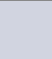

# The service for an image theme extraction


The service to get rid of the image theme extraction problem.

**Latest version**: 1.0.0

## The API route

You should use route `getTheme/[url]/{format?}[?url=URL][&count=5]`. This route allows to get the theme by image. 

`format` is an optional route part that can be `rgb255` or `hex`. The first one means 'return
result represented by 3 integer numbers in range [0; 255] in RGB format'. The second one allows to return #hex (a 
string of `#` and 6 hex digits like `#dedb3f`) value.
For detailed information about returned JSON model see 
[this](src/main/kotlin/me/vldf/colors/serializers/Rgb255ColorSerializer.kt) and 
[this](src/main/kotlin/me/vldf/colors/serializers/RgbHexColorSerializer.kt) serializers.

`url` is an optional part that allows to pass the URL of image. This URL should be provided by the `url` query 
parameter.

`count` parameter allows to pass needed count of colors to be found. The value mus be in [3, 10].

Examples:
1. `http://localhost/api/getTheme/url/rgb255?url=example.com` returns colors by image from example.com in RGB format.
2. `http://localhost/api/getTheme/hex` (and an image in PUT's body) returns colors by image from the body in HEX format.

Let's look at this picture:


After processing via API (request `localhost:8080/api/getTheme/rgb255`) we got the next result:
```json5
{
    "result": [
        {
            "r": 0,
            "g": 0,
            "b": 0
        },
        {
            "r": 136,
            "g": 133,
            "b": 146
        },
        {
            "r": 29,
            "g": 28,
            "b": 27
        },
        {
            "r": 209,
            "g": 212,
            "b": 224
        },
        {
            "r": 52,
            "g": 54,
            "b": 59
        }
    ]
}
```
That means, the key colors of the image are:

   
 

Looks so depressive. Let's try it on more colorful picture!


(request is `localhost/api/getTheme/url/rgb255?url=
https://upload.wikimedia.org/wikipedia/commons/7/74/Kotlin_Icon.png&count=4` but the link could be expired soon)

Response is:
```json5
{
    "result": [
        {
            "r": 0,
            "g": 0,
            "b": 0
        },
        {
            "r": 64,
            "g": 131,
            "b": 220
        },
        {
            "r": 246,
            "g": 135,
            "b": 17
        },
        {
            "r": 120,
            "g": 113,
            "b": 226
        }
    ]
}
```

That means:

   


**NB**: the black color occurred here because the transparent one segment of the photo represents like black color while 
processing

## Building
The [multi-stage building](https://docs.docker.com/build/building/multi-stage/) is used here. Run 
`docker build .` to build and start the service. Also, you can save the image with custom name like that: 
`docker build -t dominant-colors-extractor .`. Then you can run it via `docker run dominant-colors-extractor:latest`.

## Running
The container (and the http server too) will be run immediately after build. Also, in case of `-t` usage you can run it
via command `docker run dominant-colors-extractor:latest`. Port `8080` will be automatically used as default, but you 
can set the port via `docker run -p 12312:8080 dominant-colors-extractor:latest`
